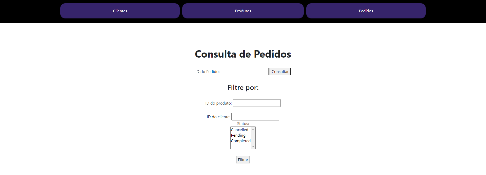
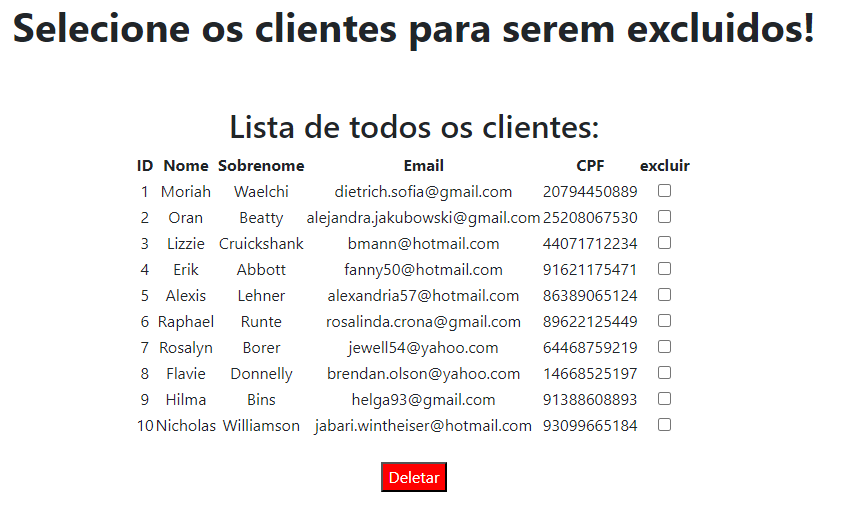
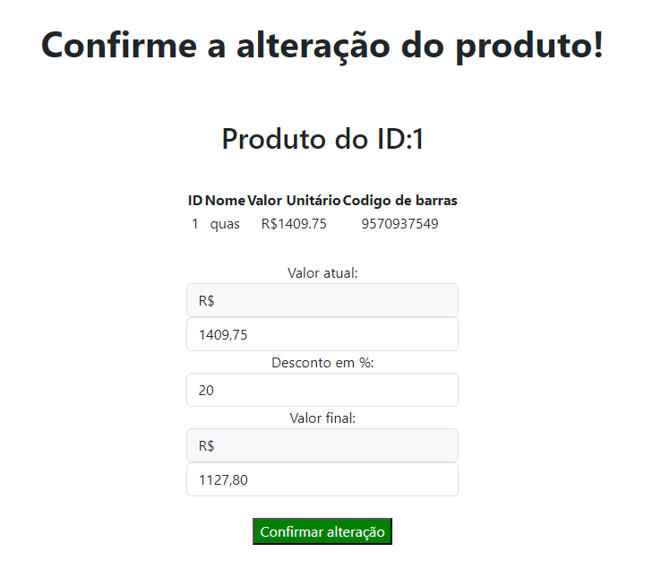

# Aplicação Web para cadastro e manutenção de pedidos, clientes e produtos

## ❕ Informações iniciais.

- A aplicação realiza o CRUD (create, read, update, delete) de três modelos, sendo eles Clients, Products e Orders.

- É possivel combinar filtros de buscas como faixas de preços, nomes e status de pedidos para obter buscas mais precisas.



- É possivel deletar e alterar qualquer item.

- Foram criadas telas de erro personalizadas!

## 📚 Pre-requisitos

Para iniciar a aplicação é necessario antes instalar e conferir os seguintes pre-requisitos:

-   [PHP ](https://www.php.net/downloads.php)
-   [Composer](https://getcomposer.org)
-   [ Laravel / Artisan](https://laravel.com/docs/10.x)

Altere as variaveis de ambiente em .env de acordo com as propiedades do seu banco de dados

```properties
DB_DATABASE= <database>
DB_USERNAME = <usuario>
DB_PASSWORD = <senha>
```

## ✈ Como rodar?

#### Inicie o servidor local (por padrão, é iniciado na porta 8000):

```php
php artisan serve
```

#### Inicie as migrations para configuração do banco:

```sh
php artisan migrate:fresh 
```

#### Inicie os seeders para alimentar o banco com dados iniciais:

```sh
php artisan db:seed
```

## 💻 Endpoints da aplicação:

### Pagina inicial

- Por padrão, o comando artisan serve roda a aplicação no seguinte endereço, mas pode ser alterado.

Pagina inicial de Boas Vindas.
```
http://127.0.0.1:8000/
```

Paginas de consulta.
```
GET
http://127.0.0.1:8000/clients/

http://127.0.0.1:8000/products/

http://127.0.0.1:8000/orders/
```

Paginas de cadastro.
```
GET
http://127.0.0.1:8000/clients/cadastrar

http://127.0.0.1:8000/products/cadastrar

http://127.0.0.1:8000/orders/cadastrar
```

Paginas de artualização.
```
GET
http://127.0.0.1:8000/clients/atualizar

http://127.0.0.1:8000/products/atualizar

http://127.0.0.1:8000/orders/atualizar
```

Paginas de deletação.
```
GET
http://127.0.0.1:8000/clients/deletar

http://127.0.0.1:8000/products/deletar

http://127.0.0.1:8000/orders/deletar
```

-⚠ Todos endpoints podem ser conferidos na [pasta](routes).

## 🤩 Implementações adicionais:

### Testes unitarios dos controllers na pasta /tests/Unit;

- Testes podem ser rodados com o comando:
```
php artisan test
```

- Configure o ambiente de testes para não afetar seu banco de dados original!

### Deletar objetos em massa;

- É possivel deletar varios objetos de uma só vez.

- Rotas para acesso as telas:
```
http://127.0.0.1:8000/clients/deletar/mass

http://127.0.0.1:8000/products/deletar/mass

http://127.0.0.1:8000/orders/deletar/mass
```



### Aplicar descontos em produtos;

- É possivel aplicar desconto a um determinado produto.

- Rota para acesso a tela:
```

http://127.0.0.1:8000/products/promo/

```



### API Rest JSON.

- A API se encontra na pasta app/Http/Controllers/API, ela possui as principais funcionalidades CRUD dos três modelos.

- Rotas para retorno de json de todos os objetos do banco:
```
GET
 
http://127.0.0.1:8000/api/clients/

http://127.0.0.1:8000/api/products/

http://127.0.0.1:8000/api/orders/
```

- As demais rotas podem ser encontradas no [arquivo](routes/api.php)

## ❤ Muito obrigado! 

- Muito obrigado por ler até aqui!

- Qualquer duvida, sugestão ou comentario sinta-se livre para entrar em contato:
    - tarcisio.olv@gmail.com
    - [Meu perfil no LinkedIn](https://www.linkedin.com/in/tarcisioaraujo7/)
